# Headroom

Headroom is an Android app that shows how much of your AI subscription limits you have left. It
covers Claude, ChatGPT Codex, GitHub Copilot, Grok, Z.AI, Kimi Code, OpenCode Go and JetBrains AI.
It has home screen and lock screen widgets, and it tells you when a weekly limit resets.

<p align="center">
  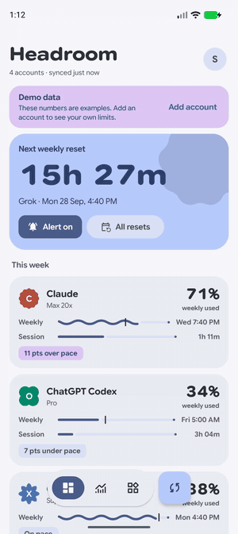
</p>

The recording is also available as a [video](docs/media/demo.mp4). It shows demo data.

> [!IMPORTANT]
> Headroom reads usage from undocumented endpoints and signs in with the same OAuth clients that
> the providers' own command-line tools use. Any provider can change or block this at any time,
> and its terms may not allow it. Headroom is meant for personal use and sideloading. It is not
> affiliated with any of the providers.

## Screenshots

| Overview | Account detail | Resets | Widgets |
|---|---|---|---|
| 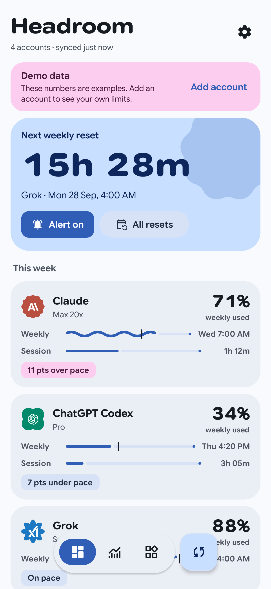 | 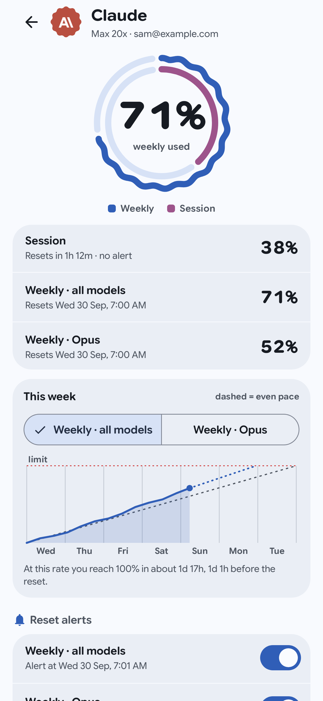 | 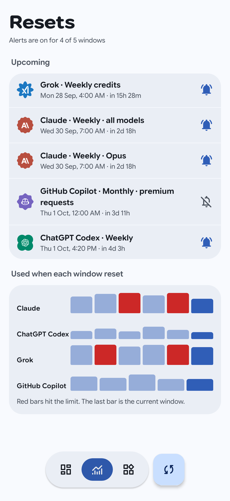 | 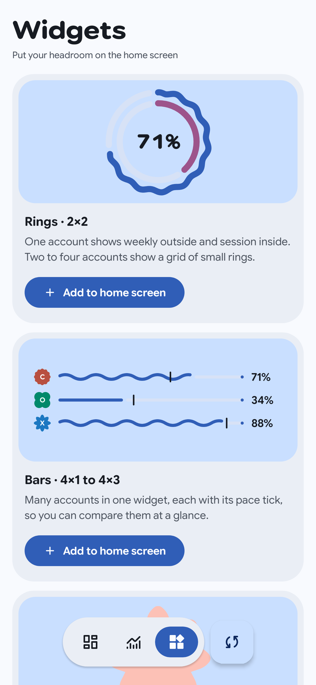 |

| Dark theme | Accounts | Sign-in with a device code |
|---|---|---|
| 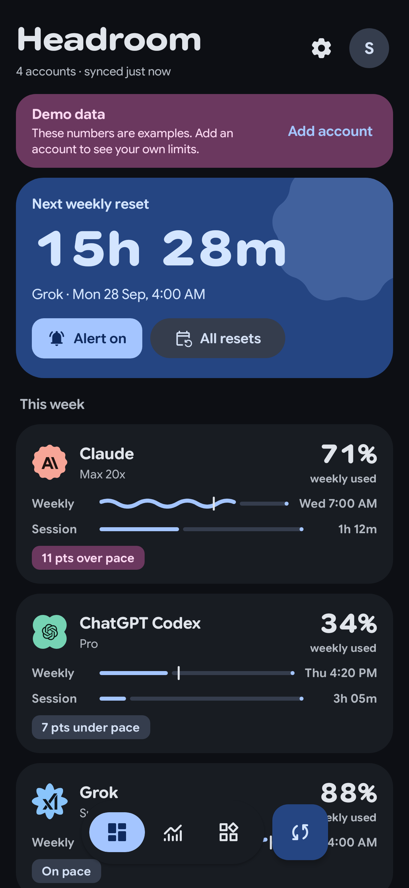 | 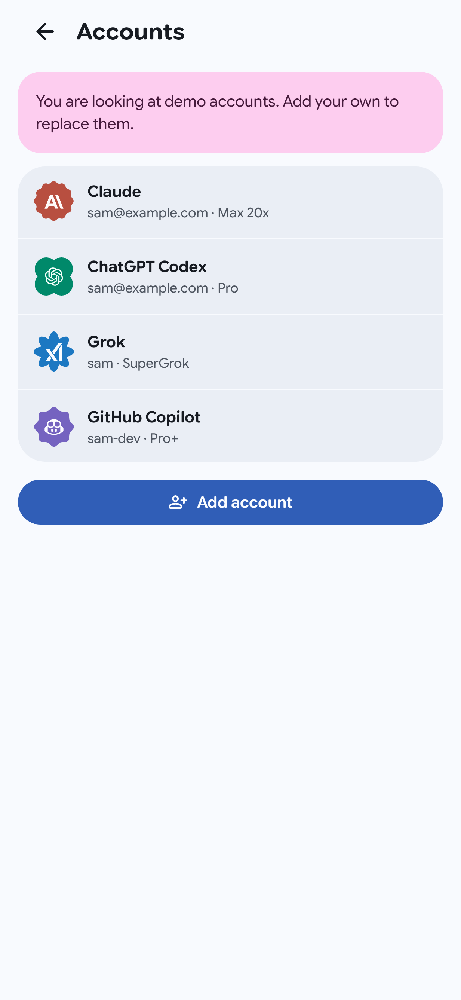 | 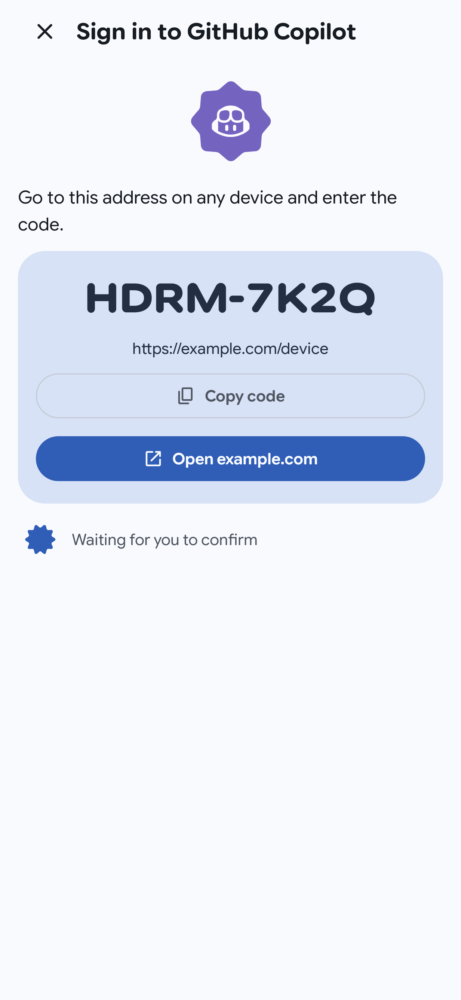 |

On a tablet or an unfolded foldable, the list and the account detail sit side by side:

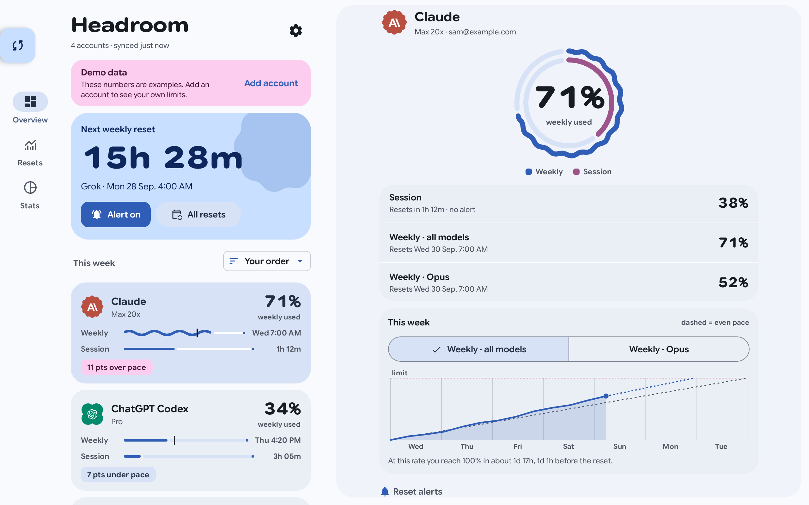

### Widgets

Every widget is a Remote Compose document drawn by the launcher. The pictures below come from the
Android 16 widget player.

| Rings, one account | Rings, several accounts | Shape |
|---|---|---|
| 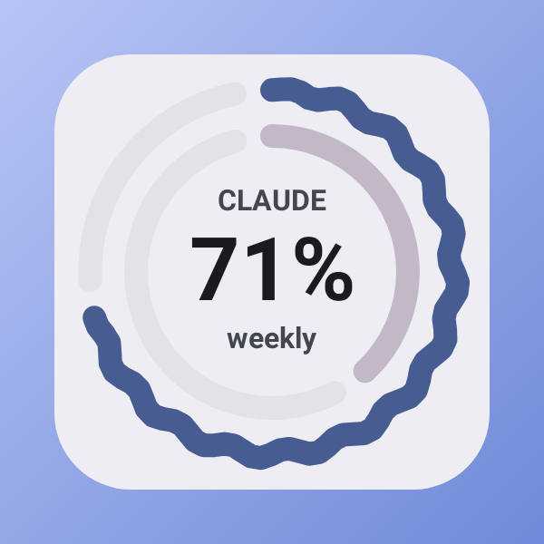 | 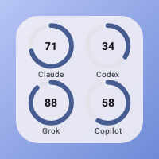 | 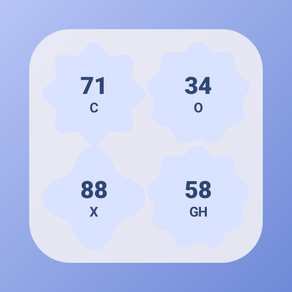 |

| Bars | Lock screen |
|---|---|
| 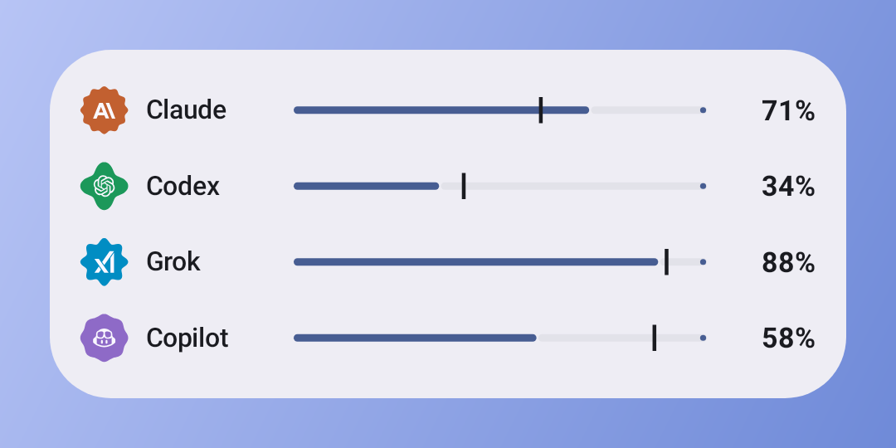 | 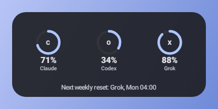 |

## Features

- **One overview for every subscription.** Each account shows its weekly (or monthly) usage, its
  session usage, and whether you are over or under an even pace.
- **Pace, not just percent.** A tick on each bar shows where you would be if you used the limit
  evenly. The detail screen draws the week to scale and says when you would reach 100% at the
  current rate.
- **Wavy means attention.** A bar is wavy only when its account is over pace or above 85%.
  Everything else stays flat.
- **Reset alerts.** Headroom sets an alarm for each weekly window. When it fires, the app fetches
  the account again and notifies you only if the reset really happened. Session and daily limits
  never alert; monthly ones can be turned on.
- **Widgets for the home screen and the lock screen.** There are four styles (Rings, Bars, Shape
  and Countdown), and each widget remembers its own accounts, window and colours.
- **Adaptive layouts.** Phones get a floating toolbar; foldables and tablets get a navigation rail,
  and on wide screens the list and the detail show side by side.
- **Demo mode.** With no account signed in, the app shows clearly labelled example data.

## Signing in

Each provider signs in the way its own tool does. Tokens are encrypted with a key in the Android
Keystore and are never backed up.

| Provider | How you sign in |
|---|---|
| Claude | Browser sign-in. The page returns to the app; if it cannot, paste the code the page shows. |
| ChatGPT Codex, Grok, JetBrains AI | Browser sign-in, returning to the app. |
| GitHub Copilot, Kimi Code | Device code: enter a short code on the provider's page. |
| Z.AI, OpenCode Go | API key. |

## Building

You need JDK 21 and the Android SDK with platform 37.

```bash
./gradlew :app:installDebug
```

The app needs Android 16 (API 36) or later.

## Project layout

| Module | What it holds |
|---|---|
| `:core:model` | Quota types, pace maths, reset rules, repository contracts, demo data |
| `:core:quota` | One fetcher per provider |
| `:core:auth` | Sign-in flows, token refresh, token store contract |
| `:core:data` | Room history, sync, reset alarms, notifications, encrypted tokens |
| `:core:designsystem` | Theme, type, quota indicators, charts |
| `:widget` | Remote Compose widgets |
| `:app` | Screens, navigation, adaptive layouts, wiring |

[docs/ARCHITECTURE.md](docs/ARCHITECTURE.md) explains how data flows between them.

## Tests and quality checks

The project is built test-first, and `./gradlew check` must pass with zero findings. It runs:

- the unit tests, including Robolectric and Compose UI tests;
- detekt, with Nacho Lopez's Compose Rules;
- ktfmt in KotlinLang style;
- Android Lint, with every warning treated as an error.

| Command | What it does |
|---|---|
| `./gradlew check` | Everything above. This is the gate for every commit and for CI. |
| `./gradlew :app:pixel9api37DebugAndroidTest` | End-to-end tests on a Gradle-managed Pixel 9 emulator with API 37, using demo data. |
| `./gradlew :app:recordRoborazziDebug` | Records the app screenshots in `docs/screenshots/`. |
| `./gradlew :widget:recordWidgetGallery` | Records the widget pictures in `docs/screenshots/widgets/`. |
| `./gradlew ktfmtFormat` | Formats the code. |

GitHub Actions runs `check` and the end-to-end tests on every pull request and on `main`
([.github/workflows/ci.yml](.github/workflows/ci.yml)).

More detail: [docs/TESTING.md](docs/TESTING.md), [docs/STATIC-ANALYSIS.md](docs/STATIC-ANALYSIS.md),
[docs/CONVENTIONS.md](docs/CONVENTIONS.md).

## Known limitations

- Nothing has been tested against real provider accounts yet. The fetchers and sign-in flows are
  tested against recorded responses and a local test server.
- Remote Compose is still alpha. The widgets use a few of its restricted APIs for the live
  countdown, and pin one library version.
- The widgets were checked in the Android 16 widget player under Robolectric, not yet on a device
  launcher. Lock screen widgets and the tap-to-flip ring are untested on hardware.
- While a browser sign-in is open, Android may stop the app in the background, which cancels the
  sign-in. If that happens, start the sign-in again.

## Credits

Most provider logos come from [models.dev](https://models.dev)
([sst/models.dev](https://github.com/sst/models.dev), MIT licence). The JetBrains mark is
adapted from [Simple Icons](https://simpleicons.org) (CC0). All logos are trademarks of
their owners. Headroom uses them only to show which provider an account belongs to.
